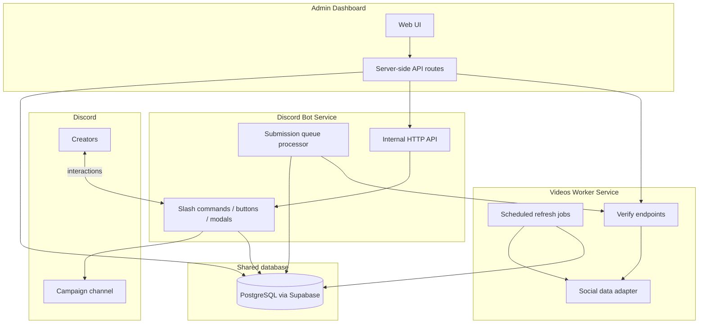
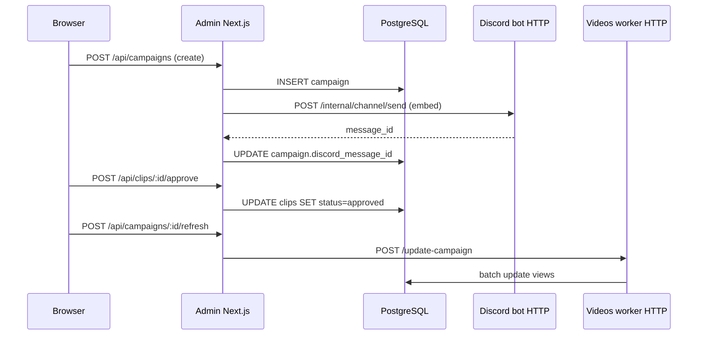

# Barebones Rebuild Spec — Discord Clipping Platform

This document describes **what the Fixated clipping platform does**, **how its three core services fit together**, and **the minimum viable version** an AI agent (or developer) needs to rebuild with a **different social-media data provider**. It intentionally avoids naming specific third-party APIs, SDKs, or vendor products for fetching social stats.

Use this as the product + architecture brief for a **$500-tier** rebuild: same core loop, fraction of the surface area.

---

## 1. What the system is for

The platform runs **paid clipping campaigns** inside a Discord community:

1. **Staff** create a campaign (budget, rate per view, allowed platforms, end date) and post it to a Discord channel.
2. **Creators** link their social accounts, join the campaign, and submit URLs to short-form videos they made for that campaign.
3. The system **verifies** that each submitted video belongs to the creator and **tracks view counts** over time.
4. **Staff** approve or reject submissions in an admin dashboard.
5. View growth drives **earnings calculations** (even a barebones version can store `views × rate` without fancy payout automation).

The full production system adds partners, teams, VIP tiers, sentiment analysis, shareable client dashboards, support tickets, leaderboards, bulk DMs, and dozens of Discord embed panels. **None of that is required for the barebones version.**

---

## 2. The three services (high level)



| Service | Role | Runs as |
|---------|------|---------|
| **Discord bot** | Creator-facing UX in Discord; accepts submissions; links accounts; optional live embed updates | Long-lived Node process (Discord gateway + small HTTP server) |
| **Videos worker** | Background engine: refresh view counts on a schedule; verify video/profile ownership on demand | Long-lived Node process (job queue + HTTP server) |
| **Admin dashboard** | Staff-facing web app: campaigns, clip moderation, manual refresh triggers | Next.js (or any SSR/SPA with server routes) |

**Why split bot and worker?** Social platforms rate-limit aggressively. The worker is the **single choke point** for all outbound “fetch video stats / verify ownership” calls. The bot stays responsive for Discord interactions and delegates heavy or scheduled work to the worker.

---

## 3. Discord bot — full system behavior

### 3.1 Tech stack

| Layer | Technology |
|-------|------------|
| Language | TypeScript (strict) |
| Discord | Discord.js v14 (gateway WebSocket + REST) |
| HTTP | Express (internal routes only — not a public API) |
| Database | Supabase client (PostgreSQL) |
| Config | Environment variables validated with Zod at boot |

The bot does **not** use Redis or BullMQ. Its async work uses a **database-backed queue table** polled in-process.

### 3.2 What creators do in Discord

**Account linking**

- Creator opens a “connect socials” panel (button on a persistent embed).
- They pick a platform and enter their username/handle in a modal.
- The system generates a short verification code and asks them to put it in their public profile bio.
- The bot (via the worker) checks the profile; on success, a row is stored linking `discord_user_id ↔ platform ↔ handle`.

**Campaign participation**

- Staff post a campaign embed (title, rate, platforms, deadline, join button).
- Creator clicks **Join** → row in `campaign_participants`.
- Creator clicks **Submit clip** → modal for a video URL → row enqueued in `submission_queue` (not processed inline — Discord interactions must respond within 3 seconds).

**Submission processing (background loop)**

Every few seconds the bot drains `submission_queue`:

1. Parse URL → detect platform + canonical video ID.
2. Call worker `POST /verify-video` with URL, platform, and creator’s linked accounts.
3. Worker confirms the video exists, metadata is readable, and ownership matches.
4. On success: insert/update `clips` row, update participant stats, DM the creator.
5. On failure: DM the creator with a reason, mark queue row failed.

**Optional polish in the full system (skip for barebones)**

- Live leaderboard embeds, campaign progress bars, voice channel names showing global stats.
- Support ticket channels, team creation, VIP applications, partner guild onboarding.
- Payment method selection (PayPal/Karat), referral tracking, demographics tiers.

### 3.3 What staff do in Discord (full system)

Slash commands that post **persistent embeds + buttons** into channels:

- Welcome / onboarding
- Connect socials panel
- My account dashboard
- Campaign notification opt-in
- Admin investigation panel (lookup user by Discord ID)

Barebones needs **at most one** setup command: post a campaign embed template, or staff paste embeds manually and only wire the Join/Submit buttons.

### 3.4 Internal HTTP API (bot as Discord RPC server)

Other services (admin, optional API layer) call the bot over HTTP with a shared secret (HMAC or API key). The bot holds the Discord client singleton and executes:

| Endpoint purpose | Example use |
|------------------|-------------|
| Send DM to user | “Your clip was approved” / “Video deleted” |
| Post or edit channel message | Campaign embed create/update |
| Assign/remove role | Verified creator, VIP |
| List guilds/channels | Admin campaign form dropdowns |
| Fetch Discord user info | Display names in admin |

**Barebones:** implement `POST /internal/dm/send` and `POST /internal/channel/send` only. Guild/channel listing can be hardcoded env vars (`DISCORD_GUILD_ID`, `DISCORD_CAMPAIGN_CHANNEL_ID`) instead of dynamic pickers.

### 3.5 Discord events handled

| Event | Behavior |
|-------|----------|
| `ready` | Register handlers; start submission queue poller (and optional embed refresh timers) |
| `interactionCreate` | Route slash commands, buttons, modals, select menus by custom ID |
| `guildMemberAdd` | Assign “unverified” / “verified” role based on DB row (optional) |
| `messageCreate` | Only if you add support tickets (skip in barebones) |

---

## 4. Videos worker — full system behavior

### 4.1 Tech stack

| Layer | Technology |
|-------|------------|
| Language | TypeScript |
| Job queue | BullMQ on Redis |
| Database | Supabase service-role client (bypasses RLS for batch writes) |
| HTTP | Node `http` or Express — health + on-demand endpoints |
| Platform access | **Pluggable adapter** — one module that talks to *your* social data provider |

The full system also runs a **comment sentiment pipeline** (ML sidecars, tier-1/tier-2 scoring). **Omit entirely for barebones.**

### 4.2 Two responsibilities

**A. Scheduled view refresh (always on)**

- Repeatable BullMQ job (default: every 2 hours, configurable).
- Load all clips in **active campaigns** with statuses like `pending`, `approved`, `tracking`.
- Group by platform; fetch current view count + basic metadata (title, thumbnail, like count if available).
- Write back to `clips.current_views` and append a snapshot to `clip_view_history`.
- Optionally aggregate per-campaign totals into `campaign_view_history`.

**B. On-demand verification (HTTP, not queued)**

Used during account linking and clip submission:

| Endpoint | Input | Output |
|----------|-------|--------|
| `POST /verify-profile` | platform, handle, verification code | `{ verified: boolean }` — reads public profile text |
| `POST /verify-video` | video URL, discord user id | `{ ok, videoId, platform, ownerHandle, initialViews, metadata }` |
| `POST /update-clip` | clip id | Synchronous single-clip refresh (admin “refresh now”) |
| `POST /update-campaign` | campaign id | Enqueues manual full-campaign refresh job |
| `GET /health` | — | `{ status: "ok" }` |

When verification runs, the worker should **pause or throttle** the bulk refresh job so both paths don’t hammer the same provider quota.

**Deletion detection (worth keeping even in barebones)**

- If the provider returns “not found” / private repeatedly (use a strike counter, e.g. 3 consecutive failures), mark clip `status = deleted`.
- Notify the creator via bot DM (worker → admin/API → bot internal HTTP).
- Include a **circuit breaker**: if >50% of requests for a platform fail in one run, assume provider outage — don’t mass-delete.

### 4.3 Social data adapter (what you replace)

The production codebase wraps platform-specific clients behind shared helpers. For a rebuild, implement **one interface**:

```typescript
interface SocialPlatformAdapter {
  /** Parse a user-pasted URL into platform + stable video id */
  parseVideoUrl(url: string): { platform: Platform; videoId: string } | null;

  /** Fetch video stats + ownership handle */
  getVideo(videoId: string): Promise<{
    views: number;
    ownerHandle: string;
    title?: string;
    thumbnailUrl?: string;
    isDeleted?: boolean;
  }>;

  /** Read public profile; return bio/about text for code verification */
  getProfile(handle: string): Promise<{ bio: string }>;
}
```

Register one adapter instance per supported platform. **All** bot and worker calls go through this layer so swapping providers is a single-file change.

Rate limiting: token bucket per platform inside the worker (configurable concurrency + delay between requests).

### 4.4 What the worker writes (tables)

| Table | Purpose |
|-------|---------|
| `clips` | Canonical video row: campaign, participant, platform, video_id, url, status, current_views, initial_views, discord_id, metadata columns |
| `clip_view_history` | Time series: `(clip_id, views, captured_at)` |
| `campaign_view_history` | Optional aggregate snapshots per campaign run |
| `update_run` / `campaign_update_job` | Optional audit of each refresh run (skip in barebones if you want fewer tables) |
| `worker_heartbeat` | Optional single row updated every 15s for admin “is worker alive?” |

---

## 5. Admin dashboard — full system behavior

### 5.1 Tech stack

| Layer | Technology |
|-------|------------|
| Framework | Next.js (App Router) |
| Auth | NextAuth (or Auth.js) with **Discord OAuth** provider |
| Data access | Server-side API routes → Supabase and/or internal backend |
| Styling | Tailwind + minimal component library (shadcn, etc.) |

The production admin is a **BFF (backend-for-frontend)**: the browser never holds service keys; every mutation goes through `/api/*` route handlers on the server.

### 5.2 Auth model

1. Admin signs in with Discord OAuth (`identify email` scope).
2. On sign-in, check allowlist:
   - Discord user ID in env `ADMIN_DISCORD_IDS`, **or**
   - Row in `admin_users` / `user_permissions` table.
3. Unauthenticated users redirect to `/auth/signin`.
4. API routes call `auth()` and return 401 if no session.

Barebones: env allowlist only — no “invite other admins” UI.

### 5.3 Pages in the full system vs barebones

| Full system page | Barebones? |
|------------------|------------|
| Campaign list (`/`) | **Yes** — table with name, status, dates, clip count |
| Create/edit campaign | **Yes** — title, description, rate, budget cap, platforms[], end date, Discord channel id |
| Campaign detail — clip table | **Yes** — filter by status; approve / reject buttons |
| Trigger campaign view refresh | **Yes** — button → worker `POST /update-campaign` |
| Per-clip refresh | Nice-to-have |
| User/creator list | **Yes** — simple table: Discord name, linked accounts, clip count |
| Settings / admin ACL | Defer — use env allowlist |
| Leaderboard | Skip |
| VIP applications | Skip |
| Partners / multi-guild | Skip |
| Support tickets | Skip |
| Share links (public client dashboards) | Skip |
| Sentiment analysis | Skip |
| Earnings freeze/recalculate | Skip — compute inline: `(current_views - initial_views) * rate` |
| Audit logs | Skip |
| API key management | Skip |

### 5.4 Key admin operations (CRUD)

**Campaigns**

- Create: insert row + call bot internal API to post embed in configured channel.
- Update: edit fields + edit Discord message if copy/rate changed.
- Delete/archive: set status `completed` or `cancelled`; optionally delete channel message.

**Clips**

- Read: paginated list for campaign with status, platform, views, submitter Discord ID.
- Update status: `pending` → `approved` | `rejected` (store optional reason).
- Approved clips should be included in worker refresh queries.

**Users**

- Read-only in barebones: join `users` + `social_accounts` + clip aggregates.

### 5.5 How admin talks to other services



Production adds a dedicated **API service** (NestJS + tRPC) between admin and bot/worker. **Barebones can skip it** and call bot/worker directly from Next.js route handlers with shared secrets — fewer moving parts, same security model (server-side only).

---

## 6. Shared data model (minimum tables)

These are the **non-negotiable** tables for the three services to communicate through PostgreSQL (Supabase is a convenient host; any Postgres works).

### `users`

| Column | Notes |
|--------|-------|
| `discord_id` | Primary key (text) |
| `discord_username` | Display |
| `created_at` | |

Created on first bot interaction or first account link.

### `social_accounts`

| Column | Notes |
|--------|-------|
| `id` | UUID |
| `discord_id` | FK → users |
| `platform` | enum: e.g. `youtube`, `tiktok`, `instagram`, `twitter` |
| `handle` | Normalized username |
| `verified_at` | null until bio verification passes |
| Unique | `(discord_id, platform)` |

### `campaigns`

| Column | Notes |
|--------|-------|
| `id` | UUID |
| `title`, `description` | |
| `status` | `draft`, `active`, `paused`, `completed` |
| `rate_per_view` | Decimal (currency per view) |
| `budget_cap` | Optional max spend |
| `platforms` | Array of allowed platforms |
| `starts_at`, `ends_at` | |
| `discord_guild_id`, `discord_channel_id`, `discord_message_id` | For embed |
| `created_by` | Admin discord id |

### `campaign_participants`

| Column | Notes |
|--------|-------|
| `campaign_id`, `discord_id` | Composite PK |
| `joined_at` | |

### `clips`

| Column | Notes |
|--------|-------|
| `id` | UUID |
| `campaign_id`, `discord_id` | |
| `platform`, `video_id`, `url` | |
| `status` | `pending`, `approved`, `rejected`, `tracking`, `deleted` |
| `initial_views`, `current_views` | Set at submit time / updated by worker |
| `submitted_at`, `reviewed_at` | |
| `reject_reason` | Optional |

Unique constraint on `(campaign_id, platform, video_id)` prevents duplicate submissions.

### `submission_queue`

| Column | Notes |
|--------|-------|
| `id` | UUID |
| `discord_id`, `campaign_id`, `url` | |
| `status` | `pending`, `processing`, `completed`, `failed` |
| `error_message` | |
| `created_at`, `processed_at` | |

Bot poller claims rows with `FOR UPDATE SKIP LOCKED` or status transitions to avoid double processing.

### `clip_view_history` (recommended)

| Column | Notes |
|--------|-------|
| `clip_id`, `views`, `captured_at` | Append-only |

### `admin_users` (optional if using env allowlist only)

| Column | Notes |
|--------|-------|
| `discord_id` | PK |
| `role` | `owner`, `admin` |

---

## 7. Core user journeys (end-to-end)

### Journey A — Creator links account

1. Creator clicks **Connect** → modal → enters handle.
2. Bot inserts `verification_codes` row (or stores pending state on `social_accounts`).
3. Bot replies: “Add code `ABC123` to your bio, then click **Verify**.”
4. Creator clicks **Verify** → bot calls worker `/verify-profile`.
5. Worker adapter reads profile bio, finds code → bot sets `social_accounts.verified_at`.

### Journey B — Creator submits clip

1. Creator clicks **Submit** on campaign embed → modal with URL.
2. Bot validates: user joined campaign, account verified for that platform, URL shape OK.
3. Bot inserts `submission_queue` row, replies “Processing…”
4. Queue worker calls `/verify-video` → inserts `clips` (status `pending`) → DMs result.
5. Admin sees clip in dashboard → **Approve**.
6. Worker next scheduled run includes clip → views accumulate → admin/creator can see totals.

### Journey C — Staff creates campaign

1. Admin fills form → `POST /api/campaigns`.
2. Server inserts `campaigns`, calls bot to post embed with buttons (`join_campaign:{id}`, `submit_clip:{id}`).
3. Stores returned `discord_message_id` on campaign row.

### Journey D — Views refresh

1. BullMQ fires every N hours OR admin clicks **Refresh views**.
2. Worker loads approved + pending clips for active campaigns.
3. Adapter fetches stats → updates `clips` + `clip_view_history`.
4. Admin campaign page shows updated view counts (poll or refresh button).

---

## 8. Inter-service authentication

Use shared secrets between services — never expose them to the browser.

| Caller | callee | Mechanism |
|--------|--------|-----------|
| Admin → Bot | HMAC header or `Authorization: Bearer <BOT_INTERNAL_KEY>` |
| Admin → Worker | `x-api-key: <WORKER_API_KEY>` |
| Bot → Worker | Same worker API key |
| Worker → Bot (DM notifications) | Bot internal key |
| Browser → Admin | NextAuth session cookie only |

Validate keys on every internal route. Reject missing/invalid with 401.

---

## 9. Barebones vs full system — scope table

| Capability | Full ($30k tier) | Barebones ($500 tier) |
|------------|------------------|------------------------|
| Discord campaign embeds + join/submit | Yes | Yes |
| Social account linking + bio verify | Yes | Yes |
| Async submission queue | Yes | Yes |
| Scheduled view tracking | Yes | Yes (longer interval OK, e.g. 6h) |
| Admin campaign CRUD | Yes | Yes |
| Clip approve/reject | Yes | Yes |
| Manual refresh button | Yes | Yes |
| Creator user list | Yes | Yes (minimal) |
| Dynamic guild/channel picker | Yes | Hardcode channel IDs |
| Dedicated API microservice | Yes | Skip — admin routes call bot/worker/DB |
| Teams, partners, VIP, tickets | Yes | Skip |
| Leaderboard / live Discord stats | Yes | Skip |
| Sentiment / comment analysis | Yes | Skip |
| Share links / client dashboards | Yes | Skip |
| Payout integrations | Yes | Skip — show calculated earnings only |
| Earnings freeze/recalc | Yes | Skip |
| Multi-guild partner program | Yes | Skip |
| Audit logs | Yes | Skip |
| Redis + BullMQ | Yes | Yes (worker only) |
| Postgres queue in bot | Yes | Yes |

---

## 10. Suggested repo layout for rebuild

Monorepo optional. Minimum three packages/apps:

```
apps/
  discord-bot/          # Discord.js + Express internal API + queue poller
  videos-worker/        # BullMQ workers + verify HTTP + platform adapter
  admin/                # Next.js dashboard + /api routes
libs/
  db/                   # Supabase types + query helpers (optional)
  platform-adapter/     # YOUR social provider implementation
```

Single `.env` or per-app env with:

- `DISCORD_TOKEN`, `DISCORD_CLIENT_ID`
- `SUPABASE_URL`, `SUPABASE_SERVICE_ROLE_KEY`
- `REDIS_URL`
- `BOT_INTERNAL_KEY`, `WORKER_API_KEY`
- `ADMIN_DISCORD_IDS` (comma-separated)
- `NEXTAUTH_SECRET`, Discord OAuth client id/secret for admin login
- **`SOCIAL_PROVIDER_API_KEY`** (or whatever your chosen vendor needs — one key, one adapter)

---

## 11. Implementation order for an AI agent

Build in this sequence so each step is testable without the others fully complete.

1. **Database schema** — migrations for tables in §6.
2. **Platform adapter** — implement `parseVideoUrl`, `getVideo`, `getProfile` against the new provider; unit test with fixture JSON.
3. **Videos worker** — `/health`, `/verify-profile`, `/verify-video`, then BullMQ repeatable refresh job.
4. **Discord bot (minimal)** — login, one slash command, connect-account flow, submit-clip → queue.
5. **Queue processor** — poll `submission_queue`, call worker verify, write `clips`, send DM.
6. **Admin auth** — Discord OAuth + allowlist.
7. **Admin pages** — campaign list/create, campaign detail clip table, approve/reject, refresh button.
8. **Wire campaign embed** — bot posts embed on campaign create; Join/Submit buttons work.
9. **Deletion notifications** — worker marks deleted → bot DM (can be last).

---

## 12. Operational notes

- **Discord interaction timeout:** always defer or acknowledge within 3s; heavy work goes to queue/worker.
- **Idempotency:** unique `(campaign_id, platform, video_id)` on clips; queue processor should tolerate retries.
- **Rate limits:** one worker instance owns provider quota; don’t call the provider from bot or admin directly.
- **Local dev:** Supabase local stack + Redis Docker + three terminal processes (`bot`, `worker`, `admin`).
- **Deploy:** three containers (or Railway/Fly services) sharing the same Postgres and Redis; admin needs a public URL for OAuth redirect.

---

## 13. What “good enough” looks like for $500

A paying client should be able to:

1. Log into admin with their Discord account.
2. Create a campaign and see it posted in their Discord server.
3. Watch creators join, link accounts, and submit clip URLs.
4. Approve clips in a web table.
5. See view counts update at least daily (manual refresh button is fine).
6. Swap social data providers by editing one adapter module — no bot or admin changes.

If those six work reliably, the barebones contract is fulfilled. Everything else in the production monorepo is upsell scope.
